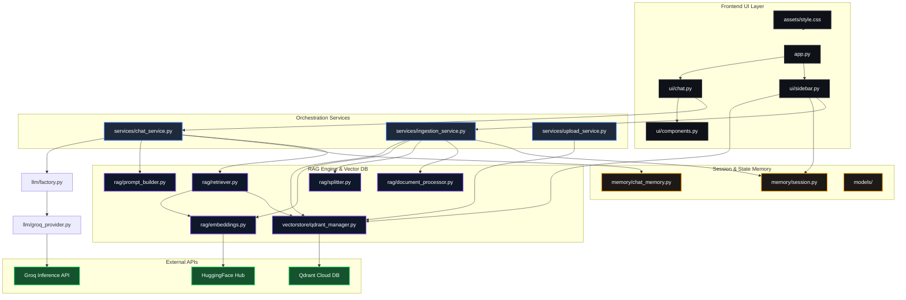
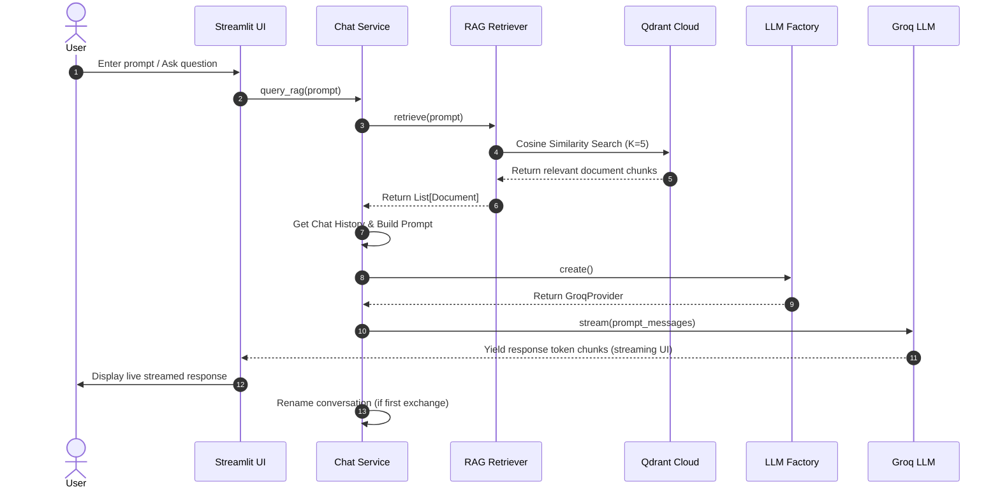
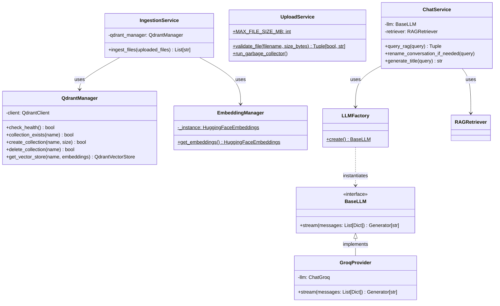

# 🚀 PagePilot: Your Premium AI RAG Knowledge Assistant

[](https://www.python.org/)
[](https://streamlit.io/)
[](https://qdrant.tech/)
[](https://groq.com/)
[](https://opensource.org/licenses/MIT)

**PagePilot** is a state-of-the-art Retrieval-Augmented Generation (RAG) chat platform that allows users to upload, process, and converse with multiple PDF documents in a fully isolated, secure session environment. Powered by **Groq Cloud** for lightning-fast inference (`llama-3.3-70b-versatile`), **Qdrant Cloud** for semantic vector indexing, and **HuggingFace** (`all-MiniLM-L6-v2`) for local token embedding generation.

Designed with **premium aesthetics**, dark-mode responsive styling, dynamic chat threading, automatic title generation, real-time database health diagnostics, and a background garbage collector to purge expired session data automatically.

---

## 🚀 Try it out live!
[**Page Pilot on HuggingFace Spaces**](https://huggingface.co/spaces/Developer49/page-pilot)

## 🎥 Demo Video

https://github.com/developer4949-code/page_pilot/raw/main/assets/page_pilot_demo.mp4


---

## 🌟 Key Features

*   **📁 Multi-Document Upload & Ingestion**: Streamlined sidebar workflow allowing concurrent ingestion of multiple PDF files (size limits: 10MB per file). Includes automated SHA256 integrity validation to skip duplicates.
*   **⚡ Sub-Second LLM Streaming**: Leverages the high-throughput Groq Cloud inference API to stream assistant response tokens live with an elegant terminal-style blinking cursor effect.
*   **📚 Precise Citations & Reference Excerpts**: Answers include clear, collapsible sources containing exact text matches, page numbers (1-indexed), chunk metadata, and document filenames to prevent hallucinations.
*   **💬 Dynamic Thread Management**: Full multi-conversation capability. Creating a new chat automatically starts a thread, and submitting the first message triggers a background completion to rename the thread title using a 3-4 word summary.
*   **🧹 Built-In Garbage Collector**: Dynamic session-based collection naming (`session_<session_uuid_without_dashes>`). The upload service automatically schedules background runs to delete local folders and drop Qdrant Cloud collections older than 24 hours.
*   **🩺 Real-Time System Health**: Active connection status checkers that display the health and availability of your Qdrant Cloud cluster in real-time.
*   **🎨 Premium UI/UX Custom Styling**: Tailored vanilla CSS styling overrides for Streamlit to enable customized glassmorphism cards, streamlined scrollbars, and customized chat elements.

---

## 🏛 High-Level Architecture

The PagePilot platform utilizes a clean three-tiered decoupling architecture: the **UI Presentation Layer** (Streamlit frontend), the **Service Orchestration Layer** (Business rules & dynamic state), and the **RAG Engine/Vector Database** (Data ingestion, embeddings, and similarity retrieval).

### High-Level Components Flow



### High-Level Sequence Diagram (Chat & RAG Retrieval)

When a user submits a query, the application coordinates context retrieval and chat response generation:



---

## 🔧 Low-Level Architecture & Blueprint

### Directory Layout

```text
PagePilot/
│
├── assets/                     # Custom visual assets & custom styling overrides
│   └── style.css               # Premium CSS overrides for custom UI/UX dark mode
│
├── config/                     # Configuration definitions
│   └── settings.py             # Global application configuration settings and defaults
│
├── ingestion/                  # Loading utilities for ingestion
│   └── pdf_loader.py           # Standard PDF extraction modules
│
├── llm/                        # LLM provider classes & Factory pattern
│   ├── factory.py              # LLM factory to dynamically create LLM instances
│   ├── provider.py             # BaseLLM abstract base class
│   └── groq_provider.py        # Groq Cloud API LLM wrapper
│
├── memory/                     # Thread state management 
│   ├── chat_memory.py          # Multithreaded message tracker in session state
│   └── session.py              # Session ID initialization and garbage collector runner
│
├── models/                     # Type-safe model contracts
│   ├── chat_message.py         # Represents a message instance with references
│   ├── conversation.py         # Represents a chat thread with title and messages
│   └── uploaded_document.py    # Represents an uploaded PDF document's metadata
│
├── rag/                        # Modular RAG component packages
│   ├── document_processor.py   # Uses LangChain PyPDFLoader to parse files
│   ├── embeddings.py           # Lazy loaded Singleton for HuggingFace embeddings
│   ├── prompt_builder.py       # Assembles prompt messages incorporating history & context
│   ├── retriever.py            # Performs similarity search queries in Qdrant collections
│   └── splitter.py             # Text splitting based on recursive character chunking
│
├── services/                   # Business orchestration logic services
│   ├── chat_service.py         # Manages search, prompt composition, and LLM streaming
│   ├── ingestion_service.py    # Orchestrates loading, chunking, embedding, and vector index
│   └── upload_service.py       # Validates uploads and hosts data cleaning processes
│
├── ui/                         # Streamlit UI Views & Modules
│   ├── chat.py                 # Renders the main chat window and handles user text inputs
│   ├── sidebar.py              # Renders document management, thread list, and health status
│   └── components.py           # Renders main header banner and collapsible citations
│
├── utils/                      # Helper frameworks
│   ├── file_utils.py           # Handles session temporary directories and SHA256 hashing
│   └── logger.py               # Generates file logs (logs/app.log) and console logs
│
├── app.py                      # Main entrypoint for Streamlit application
├── requirements.txt            # Project application Python packages list
├── .gitignore                  # Git tracking rules for Python and local folders
└── .env.example                # Configuration template for credentials
```

### Low-Level Class Diagram



### Dynamic Design Patterns Used

1.  **Singleton (Lazy Loaded)**: `EmbeddingManager` wraps `HuggingFaceEmbeddings` inside a classmethod getter. The local embedding model is downloaded and loaded only upon the first document upload.
2.  **Factory Method**: `LLMFactory` decouples provider selection from the business service layers, simplifying future integrations with OpenAI, Anthropic, or local Ollama engines.
3.  **Dynamic Session Isolation**: State management utilizes UUIDs to bound vector collections (`session_<uuid>`) and files (`temp/<uuid>`), providing absolute multi-user isolation on the same deployment container.
4.  **Automatic Garbage Collection (GC)**: An autonomous background sweep occurs on application startup and file upload cycles, checking modification times and deleting resources older than 24 hours.

---

## 💾 Data Lifecycle & Garbage Collection Policy

```
[Upload PDF] 
    │── Validate Size/Ext
    │── Generate SHA256
    │── Create temporary session directory: temp/<session_uuid>/
    │── Initialize collection in Qdrant Cloud: session_<session_uuid_without_dashes>
    │── Ingest & Vectorize (HF embeddings)
    └── Delete temporary PDF file immediately (retaining vectors only)
         
[24 Hours Expiry Trigger] 
    └── Sweep runs automatically on startup:
         ├── Delete temporary folders in temp/ older than 24 hours
         └── Call Qdrant API to drop the corresponding session collections
```

---

## 🛠 Getting Started

### 📋 Prerequisites
*   **Python**: Version `3.10` or higher.
*   **Groq API Key**: Obtain a key from the [Groq Console](https://console.groq.com/).
*   **Qdrant Cloud Credentials**: Create a free-tier cluster and obtain your cluster URL and API key from the [Qdrant Console](https://cloud.qdrant.io/).

### 🚀 Setup Instructions

1.  **Clone the Repository**:
    ```bash
    git clone https://github.com/developer4949-code/page_pilot.git
    cd page_pilot
    ```

2.  **Initialize Virtual Environment**:
    Create a new Python virtual environment and activate it:
    ```bash
    # On Windows
    python -m venv .venv
    .venv\Scripts\activate

    # On macOS/Linux
    python3 -m venv .venv
    source .venv/bin/activate
    ```

3.  **Install Required Dependencies**:
    Install all packages defined in `requirements.txt`:
    ```bash
    pip install --upgrade pip
    pip install -r requirements.txt
    ```

4.  **Configure Environment Variables**:
    Copy the template environment file:
    ```bash
    cp .env.example .env
    ```
    Open `.env` in a text editor and fill in your actual credentials:
    ```env
    GROQ_API_KEY="gsk_yourActualGroqKey..."
    QDRANT_URL="https://your-qdrant-instance-url.aws.cloud.qdrant.io"
    QDRANT_API_KEY="yourActualQdrantApiKey..."
    HF_TOKEN="optionalHuggingFaceToken..."
    ```

5.  **Run the Streamlit Application**:
    Launch the server:
    ```bash
    streamlit run app.py
    ```
    Open your browser and navigate to `http://localhost:8501`.

---

## 🧱 Technology Stack

*   **UI Framework**: [Streamlit](https://streamlit.io/)
*   **Orchestration**: [LangChain Core](https://github.com/langchain-ai/langchain), [LangChain Community](https://github.com/langchain-ai/langchain)
*   **LLM Model API**: [LangChain Groq](https://github.com/langchain-ai/langchain-groq) (`llama-3.3-70b-versatile`)
*   **Embeddings**: [LangChain HuggingFace](https://github.com/langchain-ai/langchain-huggingface) (`all-MiniLM-L6-v2`)
*   **Vector Database**: [Qdrant Client](https://github.com/qdrant/qdrant-client) & [LangChain Qdrant](https://github.com/langchain-ai/langchain-qdrant) (Qdrant Cloud deployment)
*   **PDF Parsing**: [pypdf](https://github.com/py-pdf/pypdf)
*   **Configuration & Logging**: `python-dotenv`, Python standard library `logging`
*   **Filesystem Monitor**: `watchdog`

---

> [!NOTE]
> Embedding models run locally on your CPU/GPU using the HuggingFace integration, which might take up to a minute to download on the very first document upload. Subsequent uploads are near-instantaneous.

> [!WARNING]
> Ensure that your Groq and Qdrant credentials remain private and are never checked into version control. Keep `.env` added to your `.gitignore`.
